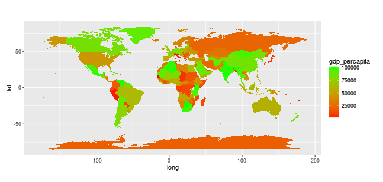

## What is GDP Per Capita ? 

GDP per capita is gross domestic product divided by midyear population. GDP is the sum of gross value added by all resident producers in the economy plus any product taxes and minus any subsidies not included in the value of the products. It is calculated without making deductions for depreciation of fabricated assets or for depletion and degradation of natural resources. Data are in current U.S. dollars.

--- .class #id 

## What you can do with this GDP World Map ?

- Chronological overview of GDP Per Capita of each Country
- Reliable data from World Bank*
- Open Source with MIT license


*http://data.worldbank.org/indicator/NY.GDP.PCAP.CD

## How to use

- On the left hand side of the panel, select the year that you want to see
- click/tap "Submit" button

--- .class #id 

## Example Report


## Some sample snippet

```{r}
      world_map$gdp_percapita <- nchar(dt[ , year]) + sample(nrow(world_map))
      
      # Prepare map based on GDP data
      gg <- ggplot(world_map,aes(map_id=region))  
      gg <- gg + geom_map(data=world_map, map=world_map, aes(map_id=region, x=long, y=lat)
        
      )
```

--- .class #id 

## Want to contribute for this project ?

- Visit us (https://tvalentius.shinyapps.io/GDPWorldMap)
- Fork our code on Github (https://github.com/tvalentius?tab=repositories)
- Enroll on Coursera Developing Data Products coursera to learn how to build your own
- Contact me at tvalentius@gmail.com


